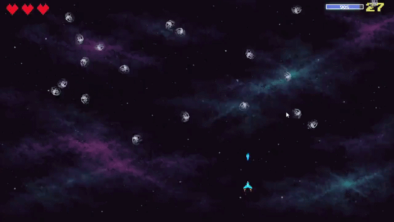

# Space War

## Descrição

Space Shooter é um jogo de tiro 2D desenvolvido em **JavaScript, HTML5 Canvas e CSS**, inspirado em clássicos de arcade.  
O jogador controla uma nave, atira em asteroides e tenta sobreviver o máximo possível. O jogo inclui:

- Música de fundo contínua  
- Sons de tiro e explosões  
- Tela de pausa  
- Tela de derrota com contagem de kills  
- Controle de vidas com corações  
- Movimento da nave e limite da tela  
- Sistema de Upgrade de personagem por quantidade de kills  
- Efeito de tela “tremendo” quando a nave leva dano  

As fontes são estilizadas com **Press Start 2P**, para efeito pixelado clássico.

---

## Estrutura de Pastas

```text

📦SpaceWar
 ┣ 📂img
 ┃ ┣ 📂enemies
 ┃ ┣ 📂ships
 ┃ ┣ 📂util
 ┃ ┃ ┣ 📂bg
 ┃ ┃ ┣ 📂effects
 ┃ ┃ ┣ 📂hearts
 ┃ ┃ ┣ 📂icons
 ┃ ┃ ┗ 📂numbers
 ┣ 📂script
 ┣ 📂sounds
 ┣ 📜index.html
 ┣ 📜README.md
 ┗ 📜styles.css
